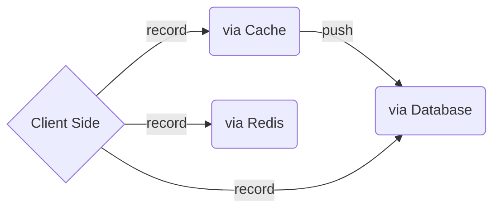
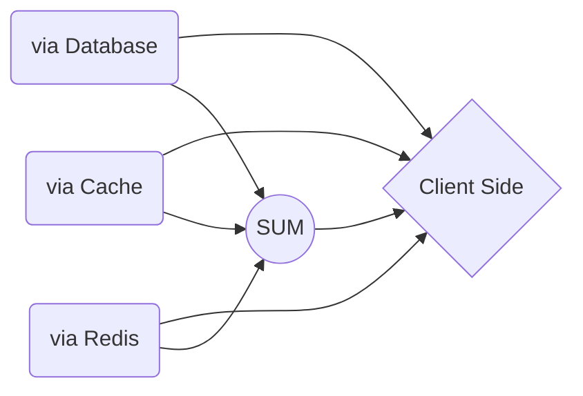

# Laravel-Eye
A Php >=7.2 Package for Laravel.

This Package is a combination of two visit counter packages :
- [shetabit/visitor](https://github.com/shetabit/visitor)
- [cyrildewit/eloquent-viewable](https://github.com/cyrildewit/eloquent-viewable)
    - and a little extra.

It Stores Each Visit based on user's **Cookie**.
The Idea is being able to Cache Visits to reduce queries.
Using Cache is better for Websites with a little higher than normal traffic.

|          | User Traffic | Queue    |
|----------|--------------|----------|
| Database | Low          | Optional |
| Cache    | Medium       | Optional |
| Redis    | High		       | False    |

> **NOTE** : If you save a high amount of data in cache, memory WILL BE EXHAUSTED. The Limitation Depends on your memory but no more than 1 million is recommended to save in cache.

These paths are provided for you to store the Visits When User Comes to your Visitable Page:



And These paths are provided to **get** the Visits from your storage:


# Install

```winbatch
$ composer require ami-hp/laravel-eye
$ php artisan vendor:publish --provider="Ami\Eye\Providers\EyeServiceProvider"
$ php artisan migrate
```
> **NOTE** : It is recommended to migrate the default __jobs__ and __failed_jobs__ tables that come with a fresh laravel project, too.

# Config
#### After Publishing the package files, you will have an `eye.php` file in your config folder.
1. Here you can define the name of your visits table.

   ```php
   'table_name' => 'eye_visits',
   ```
2. To Prevent getting Memory Errors, You can specify the maximum amount of Visits saved in cache. after reaching to the maximum, all the Visits will be inserted to database. Also, you can change your cache key, too.
   ```php
   'cache' => [  
       'key' => 'eye__records',  
       'max_count' => 1000000,  
   ],
   ```

3. A Cookie will be set for the user when arrives to your page. You can Change the key of your cookie anytime. The Expiration Time is set for 5 years, you can change that as well.
   ```php
   'cookie' =>[  
       'key' => 'eye__visitor',  
       'expire_time' => 2628000, //in minutes aka 5 years  
   ],
   ```
4. The Package uses two packages to parse user agents: **jenssegers/agent** and **ua-parser/uap-php** . On default it is set for **jenssegers**. You Can Change it to  **UAParser**.
   ```php
   'default_parser' => 'jenssegers',
   ```
5. You can decide to store crawlers visits or not. The Package will use **jaybizzle/crawler-detect** to detect crawlers.
   ```php
   'ignore_bots' => true,
   ```
6. If you wanted to use Jobs to increase speed in your inserts the package will do it for you. Feel free to turn it to false any time.
   ```php
   'queue' => true,
   ```

# Migration

```php
   Schema::create(config('eye.table_name'), function (Blueprint $table) {
            $table->bigIncrements('id');
            $table->mediumText('unique_id')->nullable();
            $table->string('method')->nullable();
            $table->mediumText('request')->nullable();
            $table->mediumText('url')->nullable();
            $table->mediumText('referer')->nullable();
            $table->text('languages')->nullable();
            $table->text('useragent')->nullable();
            $table->text('headers')->nullable();
            $table->text('device')->nullable();
            $table->text('platform')->nullable();
            $table->text('browser')->nullable();
            $table->ipAddress('ip')->nullable();
            $table->string('collection')->nullable();
            $table->nullableMorphs('visitable'); // object model
            $table->nullableMorphs('visitor'); // subject model
            $table->timestamp('viewed_at')->useCurrent();
        });
```

# Methods

### To Set Visit Model Data

```php

//To set visitable model
$eye = eye($visitable);
//OR 
$eye = eye()->setVisitable();
//And there are other ways
----------------------------
//to Change Visitor Model
//It is set to auth()->user() on default
$eye = eye()->setVisitor($userModel);
//And there are other ways
----------------------------
//To set Collection
$eye = eye()->setCollection($string);
----------------------------
//To change the parser value in config
$eye = eye()->byParser($string);
----------------------------
```

### To Get Visit Model Data
```php
eye()->request(); // == request()->all()
eye()->ip(); // == request()->ip()
eye()->url(); // == request()->fullUrl()
eye()->referer(); // == $_SERVER['HTTP_REFERER'] ?? null
eye()->method(); // == request()->getMethod()
eye()->httpHeaders(); // == request()->headers->all()
eye()->userAgent(); // == request->userAgent() ?? ''
eye()->device(); //example: Webkit, ...
eye()->platform(); //example: Windows, Mac, ...
eye()->browser(); //example: Edge, Chrome, ...
eye()->languages(); //example: ["en-us","en","fa"]
eye()->uniqueId(); // == Str::random for cookie
eye()->getCurrentVisit(); // All the above as Visit Model
eye()->getVisitorModel(); // example: User Model
eye()->getVisitableModel(); //example: Article Model
```

### Methods to Specify Storing method
> **NOTE**: If you don't use these methods, the package automatically uses all of storages
```php
$eye = $eye->viaCache(); // meaning : only using cache
$eye = $eye->viaDatabase(); // meaning : only using database
// You Can Also Combine the result of storages that you choose
$eye = $eye->viaExcept('Redis'); // meaning: Not Redis 
$eye = $eye->viaOnly('Cache' , 'Database'); // meaning: Not Redis
```

## General Methods
### period(Period $period)
You can read all of Period Documentation in this Link: 
[Cryildewit/Period](https://github.com/cyrildewit/eloquent-viewable/blob/master/README.md#between-two-datetimes)

```php
//basic example
//The Date Should be at least Y-m
$period = Period::create('2017-04-20', '2023-07-08');
$eye = $eye->period($period);

```
### unique(string $column = 'unique_id')
This chain method will assist to get Unique values base on the column you need.
* By default, it is set for unique_id .

```php
//example
$eye = $eye->unique('browser');
```

### collection(?string $name = null)
This chain method can help to get Visits or set collection for `Visit` Model.
```php
//example
$eye = $eye->collection('articles');
```

### visitor(?Model $user = null , bool $whereMode = true)
This chain method will replace visitor fields in `Visit` Model.
* It is useful for getting the User's activity.
By default `$whereMode` in true which means :
Everytime you are fetching data it will use `->where('visitor_type' , $type)->where('visitor_id' , $id)` methods to get them. 
```php
//example
$user = User::findOrFail(1);

$eye = $eye->visitor($user);
//or
$eye = $eye->visitor($user , false); // to disable where() query methods
```


### public function visitable(Model|null|bool $post = null)
This chain method has two usages based on Argument:
1. **Model or Null** : It will Replace value of `visitable_type` and `visitable_id` in `Visit` Model. For Fetching visits it will use `->where('visitable_type' , $type)->where('visitable_id' , $id)` 
2. **Bool** False : IF ONLY false was given it will disable `where()` methods
```php
//example
$post = Article::findOrFail(1);

$eye = $eye->visitable($post);
//or
$eye = $eye->visitable(false); // to disable where() query methods
```

### get()
It will Fetch Visits from database or cache with the help of the queries you specified (like above).
```php
//example
$eye = $eye->get();
```

### count()
It does the exact thing as `get()` does. but returns Integer.
```php
//example
$eye = $eye->count();
```
> **NOTE:** If you don't specify one storing method ,`get()`and`count()` will fetch data from multiple storages and combines them.
>**example:**
>
> If `eye()->viaCache()->count()` returns 6 and `eye()->viaDatabase()->count()` returns 50, `eye()->count()` will return 56. 


### once()
This method will check if the visitor has a record from before, it will not record another one unill the user's cookie expires.
```php
//example
$eye = $eye->once();
```

### record(bool $once = false , ?Model $visitable = null, ?Model $visitor = null)

```php
//simple example
$eye->record();

//or

$post = Post::findOrFail(1);
$user = User::findOrFail(1);
$eye->record(
        once      : true,  // == once()
        visitable : $post, // == ->setVisitable($post)
        visitor   : $user, // == ->setVisitor($user)
    ); 
```
