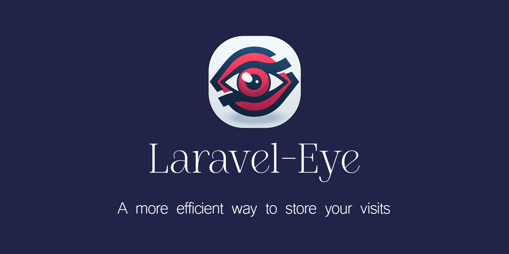
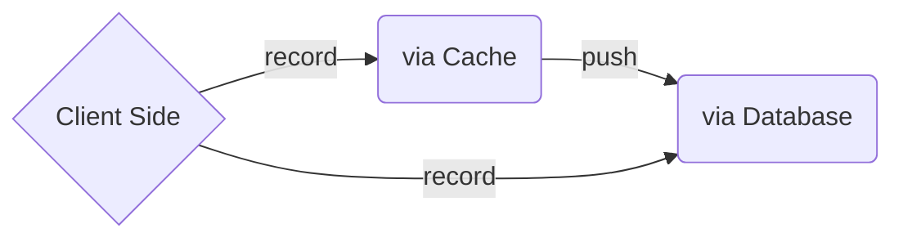
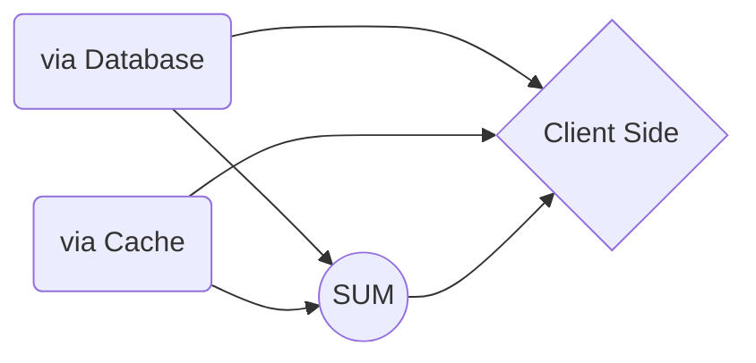

# Laravel-Eye
<p align="center">

</p>

<p align="center">
<a href="https://packagist.org/packages/ami-hp/laravel-eye"></a>
<a href="https://packagist.org/packages/ami-hp/laravel-eye"></a>
<a href="https://packagist.org/packages/ami-hp/laravel-eye"></a>
</p>

A Php >=7.2 Package for Laravel.

This Package is a combination of two visit counter packages :
- [shetabit/visitor](https://github.com/shetabit/visitor)
- [cyrildewit/eloquent-viewable](https://github.com/cyrildewit/eloquent-viewable)
- and a little extra.

It Stores Each Visit based on user's **Cookie**.
The Idea is being able to Cache Visits to reduce queries.
Using Cache is better for Websites with a little higher than normal traffic.

| Storing Method | Speed  |
|----------------|--------|
| Database       | Low    |
| Cache:file     | Medium |
| Cache:redis    | High		 |

> **NOTE** : If you save a high amount of data in cache, memory WILL BE EXHAUSTED. The Limitation Depends on your memory but no more than 1 million is recommended to save in cache.

These paths are provided for you to store the Visits When User Comes to your Visitable Page:



And These paths are provided to **get** the Visits from your storage:


# Install

```winbatch
$ composer require ami-hp/laravel-eye
$ php artisan vendor:publish --provider="Ami\Eye\Providers\EyeServiceProvider"
$ php artisan migrate
```
> **NOTE** : It is recommended to migrate the default __jobs__ and __failed_jobs__ tables that come with a fresh laravel project, too.

# Config
#### After Publishing the package files, you will have an `eye.php` file in your config folder.
1. Here you can define the name of your visits table.

   ```php
   'table_name' => 'eye_visits',
   ```
2. To Prevent getting Memory Errors, You can specify the maximum amount of Visits saved in cache. after reaching to the maximum, all the Visits will be inserted to database. Also, you can change your cache key, too.
   ```php
   'cache' => [  
       'key' => 'eye__records',  
       'max_count' => 1000000,  
   ],
   ```

3. A Cookie will be set for the user when arrives to your page. You can Change the key of your cookie anytime. The Expiration Time is set for 5 years, you can change that as well.
   ```php
   'cookie' =>[  
       'key' => 'eye__visitor',  
       'expire_time' => 2628000, //in minutes aka 5 years  
   ],
   ```
4. The Package uses two packages to parse user agents: **jenssegers/agent** and **ua-parser/uap-php** . On default it is set for **jenssegers**. You Can Change it to  **UAParser**.
   ```php
   'default_parser' => 'jenssegers',
   ```
5. You can decide to store crawlers visits or not. The Package will use **jaybizzle/crawler-detect** to detect crawlers.
   ```php
   'ignore_bots' => true,
   ```
6. If you wanted to use Jobs to increase speed in your inserts the package will do it for you. Feel free to turn it to false any time.
   ```php
   'queue' => true,
   ```

# Migration

```php
   Schema::create(config('eye.table_name'), function (Blueprint $table) {
            $table->bigIncrements('id');
            $table->mediumText('unique_id')->nullable();
            $table->string('method')->nullable();
            $table->mediumText('request')->nullable();
            $table->mediumText('url')->nullable();
            $table->mediumText('referer')->nullable();
            $table->text('languages')->nullable();
            $table->text('useragent')->nullable();
            $table->text('headers')->nullable();
            $table->text('device')->nullable();
            $table->text('platform')->nullable();
            $table->text('browser')->nullable();
            $table->ipAddress('ip')->nullable();
            $table->string('collection')->nullable();
            $table->nullableMorphs('visitable'); // object model
            $table->nullableMorphs('visitor'); // subject model
            $table->timestamp('viewed_at')->useCurrent();
        });
```
-------
# Usage

* ### [Complete Documentation](./docs/Docs.md)


* [How To Record A Visit](#how-to-record-a-visit)
  * [Step 1: Set Visit Data From Start](#step-1-set-visit-data-from-start)
     * [Set Visitable Model](#set-visitable-model) 
     * [Set Visitor Model](#set-visitor-model) 
     * [Set Collection](#set-collection) 
  * [Step 2: Choose Your Storing Method](#step-2-choose-your-storing-method)
     * [Store Visits in Database](#store-visits-in-database) 
     * [Store Visits in Cache](#store-visits-in-cache)
     * [Store Visits in Redis](#store-visits-in-redis)
  * [Step 3: Set Data via Storing Methods](#step-3-set-data-via-storing-methods)
     * [Set Visitable Model](#set-visitable-model-1)
     * [Set Visitor Model](#set-visitor-model-1)
     * [Set Collection](#set-collection-1)
  * [Step 4: Define Conditions](#step-4-define-conditions)
  * [Step 5: Record the Visit](#step-5-record-the-visit)
  * [Additional Examples](#additional-examples)


    
* [How To Retrieve From Each Storage](#how-to-retrieve-from-each-storage)
  * [Step 1: Selecting the Data You Need](#step-1-selecting-the-data-you-need)
     * [Selecting Visitable or Url](#selecting-visitable-or-url) 
     * [Selecting Visitor](#selecting-visitor) 
     * [Selecting Collection](#selecting-collection) 
  * [Step 2: Add More Conditions](#step-2-add-more-conditions-1)
     * [Select Visits In a Period of time](#select-visits-in-a-period-of-time)
     * [Select Visits with a Unique Value](#select-visits-with-a-unique-value)
  * [Step 3: Fetch Data From Storage](#step-3-fetch-data-from-storage)


* [How To Retrieve From Multiple Storages](#how-to-retrieve-from-multiple-storages)
  * [Step 1: Select Storing Methods](#step-1-select-storing-methods)
  * [Step 2: Select Visit Models](#step-2-select-visit-models)
     * [Select Visitable Model](#select-visitable-model)
     * [Select Visitor Model](#select-visitor-model)
     * [Select collection](#select-collection)
  * [Step 2: Add More Conditions](#step-2-add-more-conditions-1)
     * [Select A Period of Time](#select-a-period-of-time)
     * [Select Unique Values](#select-unique-values)
  * [Step 3: Retrieve Visits](#step-3-retrieve-visits)


* [How To Delete Visits](#how-to-delete-visits)
  * [Delete All](#delete-all)
  * [Delete Selected Visits](#delete-selected-visits)
  

* [How To Use Traits](#how-to-use-traits)
  * [EyeVisitable Trait](#eyevisitable-trait)
  * [EyeVisitor Trait](#eyevisitor-trait)
-------
## How To Record A Visit
You can record a Visit in various ways but first, you have to set your data to form a Visit model to be recorded.

### Step 1: Set Visit Data From Start
The Visit Model is connected to the [visit table](#migration) which is shown above
It is possible to Set Data From Start To the end of the chained methods.

#### Example
```php
$post = Post::first();
$user = User::first();
$name = 'name of collection';

//if you wanted to set data
$eye = eye($post)->setVisitor($user)->setCollection($name);

//also if you didn't want to set data you can
$eye = eye();
```

#### Set Visitable Model
If you don't use this method, by default visitable model is set to be `NULL`. 
```php
$post = Post::first();

eye($post)
//or
eye()->setVisitable($post);
```

#### Set Visitor Model
If you don't use this method, by default visitable model is set to be `auth()->user()`.
```php
$user = User::first();

eye()->setVisitor($user);
```

#### Set Collection
If you don't use this method, by default it is set for `NULL`.
```php
$name = 'name of collection';

eye()->setCollection($name);
```

### Step 2: Choose Your Storing Method
You can choose your storage, which is where you want to store your visits in.

#### Example
```php
eye()->viaDatabase();
//or
eye()->viaCache()
```

#### Store Visits in Database
Storing visits in database is a common way to store data. By using this method everytime a user visits,
a query will be made to be inserting your data to database. By default, this method uses queue to insert data but,
you can always turn it off by changing the value of queue to `false` in the config file `eye.php`.
> Pros : Gaining More control over visits with Visit model being connected to database. 
> 
> Cons : Interacting with database takes time. And if your website simultaneously has a lot of visitors
> it will slow your website down. 

```php
eye($post)->viaDatabase();
```

#### Store Visits in Cache
Using Cache as storage works as a bypass for inserting data to database. But you can hold the data
in cache as long as you want. There is a Limit to the number of visits you can save, and it is
in your control by changing `cache.max_count` in config file `eye.php`. After Reaching to maximum, the package will automatically push visits to database. Key name of cache is also there to be changed if you needed.
```php
eye($post)->viaCache();
```

#### Store Visits in Redis
The only thing you should do is to change `CACHE_DRIVER` to `redis` so the package will use Redis through Cache.
The storing method is still `viaCache()`.

### Step 3: Set Data via Storing Methods
You can also set data from this stage instead of setting it before choosing your storing method.
there is no difference.

> **NOTE:** These methods are included in an **interface** so, they work in all storing methods.

#### Example
```php
$eye = eye()->viaDatabase(); //OR
$eye = eye()->viaCache();

$post = Post::first();
$user = User::first();
$name = 'name of collection';

$eye->collection($name)
    ->visitor($user)
    ->visitable($user);
```

#### Set Visitable Model
If you don't use this method, by default visitable model is set to be `NULL`.
```php
$post = Post::first();

eye()->viaCache()->visitable($post);
//SAME AS
eye($post)->viaCache();
```

#### Set Visitor Model
If you don't use this method, by default visitable model is set to be `auth()->user()`.
```php
$user = User::first();

eye()->viaCache()->visitor($user);
//SAME AS
eye()->setVisitor($user)->viaCache();
```

#### Set Collection
If you don't use this method, by default it is set for `NULL`.
```php
$name = 'name of collection';

eye()->viaCache()->collection($user);
//SAME AS
eye()->setCollection($name)->viaCache();
```
### Step 4: Define Conditions

#### Record only Once
By using the method package will check if the user has a record stored or not.
If the user had already visited the page so a new visit WILL NOT be recorded.

It works with the cookie that package set for user when enters the page,
and will be stored as `unique_id`.

> **NOTE:** You can change the key of cookie and expiration time in config file `eye.php`
> by changing `cookie.key` and `cookie.expire_time`.
```php
$name = 'name of collection';

eye()->viaCache()->once();
```

### Step 5: Record the Visit
In the end you can insert the Visit Model to database or Cache.
The Structure is basically this:

```php
Step1->Step2->Step3->Step4->record(bool $once = false, ?Model $visitable = null, ?Model $visitor = null);
```
It means that you can also set the visitable and visitor from this method.

```php
$post = Post::first();
$user = User::first();

eye()->viaCache()->record(true , $post , $user);
//SAME AS
eye($post)->viaCache()->visitor($user)->once()->record();
```

#### Additional Examples
```php
$post = Post::first();
$user = User::first();
$name = 'name of collection';

eye()->viaDatabase()->collection($name)->visitable($post)->record();
eye($post)->viaCache()->once()->record(); // Recommended
```
--------
# How To Retrieve Visits
You might want to list the Visits with details or just count them. It is all possible.
You can do it for each storage separately or all together combined.

The Steps are very similar to Recording Steps.

## How To Retrieve From Each Storage
If you needed to retrieve data from each storage individually,
you just need to use their storing method.
```php
eye()->viaCache() 
// OR
eye()->viaDatabase()
```
> **NOTE:** The Following Steps apply to all storing methods.

### Step 1: Selecting the Data You Need
It works exactly like setting data.

#### Selecting Visitable or Url
If you pass a model to visitable methods,
It will select the Visits with the visitable model.
But if you don't, it will select the url that the route is in.
It works for `NULL` too.

For Visitable:
```php
$post = Post::first(); // or NULL

eye($post)->viaCache(); // Simplified
//or
eye()->setVisitable($post)->viaCache();
//or
eye()->viaCache()->visitable($post); // Humanized
```
Result:
```php
->where('visitable_id'   , $post->id)
->where('visitable_type' , get_class($post))
```

For Url:
```php
eye()->viaCache();
```

Result:
```php
->where('url' , request()->fullUrl())
```
Sometimes you don't need to enable a where clause for your query.
you can **disable** it by using `visitable(false)`.

```php
eye()->viaCache()->visitable(false);
```
#### Selecting Visitor
It is possible if you wanted to fetch the Visits that a specific visitor made.
And you can pass `NULL` as well.
> The difference between this method and the one in record steps is that
> you need to turn `$whereMode` argument to `true`. otherwise it just sets visitor. 

```php
$user = User::first(); // or NULL

eye()->viaCache()->visitor($user , true);
```
Result:
```php
->where('visitor_id'   , $user->id)
->where('visitor_type' , get_class($user))
```

#### Selecting Collection
```php
$name = 'name of collection';

eye()->viaCache()->collection($name);
```
Result:
```php
->where('collection' , $name)
```

### Step 2: Add More Conditions

#### Select Visits In a Period of time
The `period()` method passes a `Period` class as argument.
> You can read all about this class in
[Cryildewit/Period](https://github.com/cyrildewit/eloquent-viewable/blob/master/README.md#between-two-datetimes)

```php
$startDateTime = '1997-01';
$endDateTime   = '2023-08-17 10:11:00';
$period = Period::create($startDateTime , $endDateTime); //example

eye()->viaCache()->period($period);
```

Result:
```php
if ($startDateTime !== null && $endDateTime === null) 
    ->where('viewed_at', '>=', $startDateTime);
elseif ($startDateTime === null && $endDateTime !== null)
    ->where('viewed_at', '<=', $endDateTime);
elseif ($startDateTime !== null && $endDateTime !== null)
    ->whereBetween('viewed_at', [$startDateTime, $endDateTime]);
```

#### Select Visits with a Unique value
There can be multiple rows with the same value in a column.
By default, the method uses `unique_id` column which is the cookie of user.

##### via *Cache*
```php
$column = 'unique_id';
eye()->viaCache()->unique($column);

```

Result:
```php
->unique($column)
```

##### via *Database*
The Problem is that it doesn't work the same for all storing methods.
In `viaCache` it retrieves for both fetching Visits details and counting,
but in `viaDatabase` it only works with counting.

```php
$column = 'unique_id';
eye()->viaCache()->unique($column)->count();
```

Result:
```php
->distinct()->count($column);
```
### Step 3: Fetch Data From Storage
Finally, you can retrieve data only by using `count()` or `get()`

The Structure is basically this:

```php
Step1->Step2->count(); // returns Int
Step1->Step2->get();   // returns collection of Visit models
```
Get creative with it.
#### Examples
```php
eye($post)->viaCache()
          ->unique()
          ->count();
// OR
eye()->viaDatabase()
     ->collection('name')
     ->visitor($user)
     ->get();
```
## How To Retrieve From Multiple Storages
When using cache, after reaching the maximum amount package will push
visits to database. or maybe you accidentally used multiple storages. 
The package provides you methods to use multiple storing methods all at once.

### Step 1: Select Storing Methods

#### Select All
It's very simple.
```php
eye()
// or
eye()->via('database' , 'cache'); // means both of them

```

### Step 2: Select Visit Models
Do it as if you're using storages individually. It works the same.

#### Select Visitable Model

```php
$post = Post::first();

eye($post);
//or
eye()->visitable($post);
```
#### Select Visitor Model
```php
$user = User::first();

eye($post);
//or
eye()->visitor($post);
```
#### Select collection
```php
$name = 'collection';

eye($post)->collection($name);
```
### Step 2: Add More Conditions

#### Select A Period of Time
```php
$startDateTime = '1997-01';
$endDateTime   = '2023-08-17 10:11:00';
$period = Period::create($startDateTime , $endDateTime); //example

eye()->period($period);
```

#### Select Unique Values
By default, it is set for `unique_id`.
```php
$column = 'platform';

eye()->unique($column);
```
> As mentioned before, it only works on counting for database.

### Step 3: Retrieve Visits
Combine the previous methods and add `get()` or `count()`.
#### Examples
```php
eye($post)->collection($name)->unique()->count();
eye()->via('cache' , 'database')->visitor($user)->get();
```

## How To Delete Visits
Sometimes you need to delete some recorded visits from your storages.
This package provides you some methods to do it individually or delete them all at once.
> **NOTE:** Unique method does not work here
### Delete All
- Step 1 : Select Storing Methods
- Step 2 : Truncate
#### Examples
```php
eye()->truncate(); // Removes All Visits in Every Storage
eye()->viaCache()->truncate(); // Removes All Visits in a storage
eye()->via('database' , 'cache')->truncate(); // Removes All Visits in selected storages

```
### Delete Selected Visits
Selecting visits work exactly like retrieving them.

- Step 1 : Select Storing Methods
- Step 2 : Select Visits
- Step 3 : Delete

#### Examples
```php
eye($post)->collection($name)->delete();
eye()->viaCache()->visitor($user , true)->delete();

eye()->via('cache')
     ->visitable(false)
     ->visitor($user , true)
     ->collection($name)
     ->delete();
```

----------
## How To Use Traits
You can also get visits data through you morphed models.

### EyeVisitable Trait
Add `EyeVisitable` to your visitable model.

#### Observer
Visitable observer will monitor your model's activity so, 
when your model got (force) deleted visits
gets deleted as well by this code:

```php
public function deleted(Model $visitable)
{
    if ($visitable->isForceDeleting())
        eye($visitable)->delete();
}
```

#### Relations
In order to use eager loading you will need database relationships.
```php
public function visits()
{
    return $this->morphMany(Visit::class, 'visitable');
}
```
Usage examples:

```php
$posts = Post::with('visits')->get();

foreach ($posts as $post){
    $post->visits; // collection of visits
}

//OR

$posts = Post::withCount('visits')->get();

foreach ($posts as $post){
    $post->visits_count; // int
}
```
As you know, morphMany relationships are related to database,
so somehow we need to access cached visits as well.
this method also has been added to trait to access cached visits more easily.
```php
public function cachedVisits(?string $unique = null , ?string $collection = null , ?Model $visitor = null): Collection  
```
Usage examples: 
```php
$visits = $post->cachedVisits(); //collection of visits
// OR
$visits = $post->cachedVisits('unique_id' , 'name of collection' , $user);


$visits->count(); //int
```

### EyeVisitor Trait
Add `EyeVisitor` to your visitor model. and the rest is similar to visitable trait.

#### Observer
```php
public function deleted(Model $visitor)
{
    if ($visitor->isForceDeleting())
        eye()->visitor($visitor)->visitable(false)->delete();
}
```

#### Relations
```php
public function visits()
{
    return $this->morphMany(Visit::class, 'visitor');
}
```
```php
public function cachedVisits(?string $unique = null , ?string $collection = null , $visitable = false): Collection
```